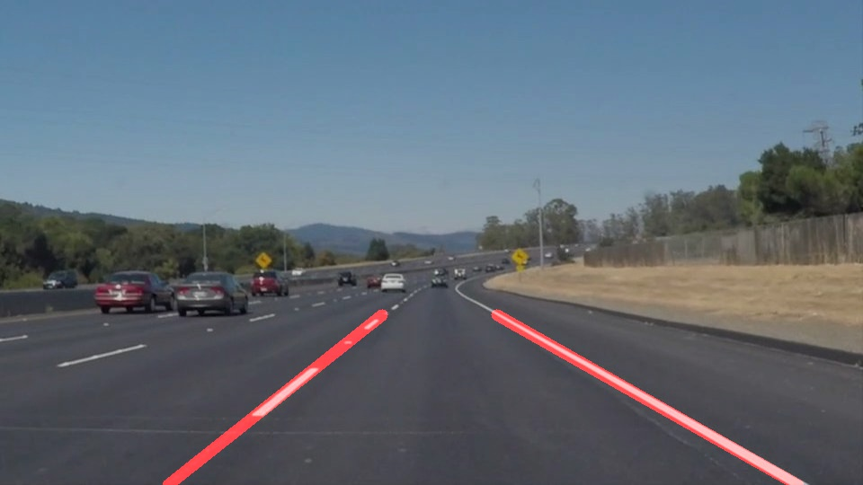

# **Finding Lane Lines on the Road** 

**Chundi Himakiran Kumar**

---

**Finding Lane Lines on the Road**

In this project we have attempted to detect lane lines on road both for images as well as videos using Python, OpenCV and other Python libraries like Numpy, Matplotlib and Sympy.


---

 

### Reflection

### 1. Pipeline construction.

My pipeline is contained in the "draw_line_on_image" function.
```python
   # The below function implements the pipeline
def draw_line_on_image(img):    
    # Read in and grayscale the image
    gray_img = grayscale(img)    
    # Define a kernel size and apply Gaussian smoothing
    kernel_size = 5
    blur_gray = gaussian_blur(gray_img,kernel_size)
    # Define our parameters for Canny and apply
    low_threshold = 50
    high_threshold = 100
    edges = canny(blur_gray, low_threshold, high_threshold)    
    # Masking the result of Canny edge detection
    imshape=img.shape
    vertices = np.array([[(50,imshape[0]),(400, 350), (500, 350), (imshape[1],imshape[0])]], dtype=np.int32)
    masked_edges = region_of_interest(edges,vertices)    
    # Passing the masked image to Hough transform to draw the lines
    rho = 1 # distance resolution in pixels of the Hough grid
    theta = np.pi/180 # angular resolution in radians of the Hough grid
    threshold = 20     # minimum number of votes (intersections in Hough grid cell)
    min_line_length = 20 #minimum number of pixels making up a line
    max_line_gap = 300   # maximum gap in pixels between connectable line segments
    line_image = hough_lines(masked_edges, rho, theta, threshold, min_line_length, max_line_gap)
    w_image = weighted_img(line_image, img, α=0.8, β=1., γ=0.)    
    return w_image
```
a.The pipeline used the given helper functions. 

b. The parameters for the Canny function and the kernel size were first found using trial and error and the edges obtained.

c. This gave us the below image

 

d. Now using trial and error we found the region of interest parameters. This gave us the below image


e. Further trial and error gave us the parameters for Hough Transform and the extrapolation performed in the draw_lines function gave us below the following images


### 2.  Extrapolation : draw_lines


This was the most difficult part of the project. Separating the points of the left lane and the right lane
was trivial. Using the slope calculated we could do it easily.
To do the extrapolation we decide to first find the top most start point y co-ord. If this came from say a point in the left lane
then we used the same y coord and extrapolated the right lane start point by calculating the x coord using the slope and intercept of the right lane. And we do the same thing vice a versa if the top most start point is from the right lane.

Once we get the two start points for each lane we extrapolate the end points. This we do by setting the y coord of both
end points equal to the image height and then we calculate the x coord for each end point.

Thereafter we use the cv2.line function to draw both the lanes.

     

    


### 3. Potential shortcomings with my current pipeline


I think my pipeline is obviously image dependent as the draw line function requires the image height to extrapolate.
The parameters of the Canny and Hough Transform as also the parameters of the region of interest are very finely tuned to the input required for the draw_lines function. This probably should not be the case.
Maybe thereis a better way of extrapolating using openCV fitline function.


### 3. Suggest possible improvements to your pipeline

A possible improvement would be to use np.polyfit with degree three to get past the curves.
Another improvement would be a better way of extrapolating.


